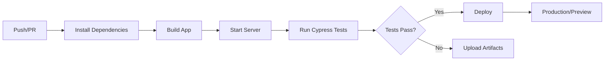

# 🤖 GitHub Workflows

Este directorio contiene la configuración de automatización para CI/CD del proyecto Evently.

## 📁 Contenido

### Workflows

- **`test-and-deploy.yml`** - Workflow principal de CI/CD
  - Ejecuta tests de Cypress automáticamente
  - Despliega a producción cuando los tests pasan
  - Crea deploys de preview para PRs

## 🚀 Quick Start

### 1. Configurar Secrets

Ve a `Settings` → `Secrets and variables` → `Actions` y agrega:

```
VERCEL_TOKEN
ORG_ID
PROJECT_ID
```

> **Nota:** Las variables `VITE_SUPABASE_URL`, `VITE_SUPABASE_ANON_KEY` y `VITE_RECAPTCHA_SITE_KEY` se configuran en Vercel Dashboard → Environment Variables.

### 2. Trigger Manual

```bash
# En GitHub:
Actions → Test and Deploy → Run workflow
```

### 3. Trigger Automático

```bash
# Push a main
git push origin main

# Crear PR
gh pr create --base main
```

## 📊 Proceso de CI/CD



## 📚 Documentación

Para más detalles, ver [`GITHUB_ACTIONS_SETUP.md`](./GITHUB_ACTIONS_SETUP.md)

## 🔗 Enlaces Útiles

- [GitHub Actions Docs](https://docs.github.com/en/actions)
- [Cypress GitHub Action](https://github.com/cypress-io/github-action)
- [Vercel Deploy Action](https://github.com/amondnet/vercel-action)

---

**Mantenido por**: Equipo Evently
